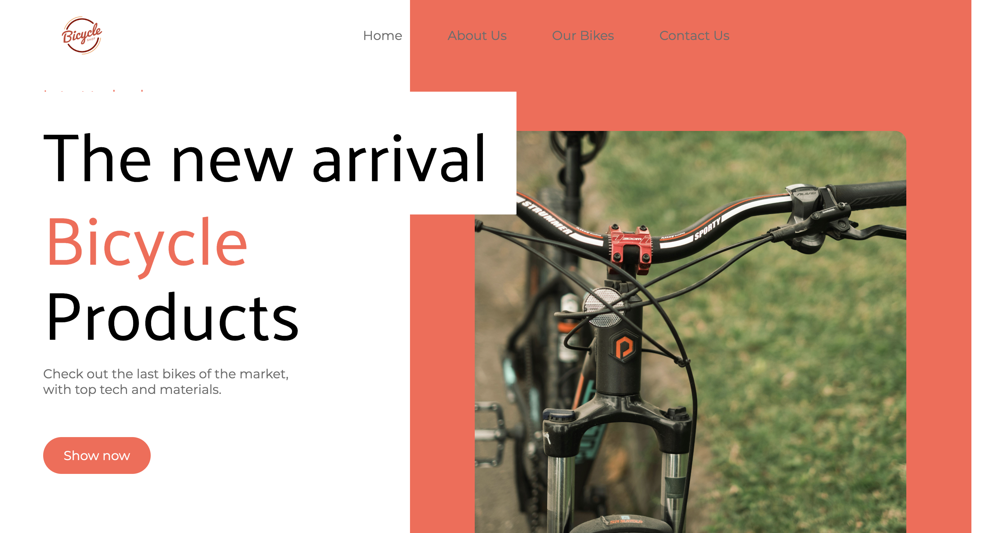
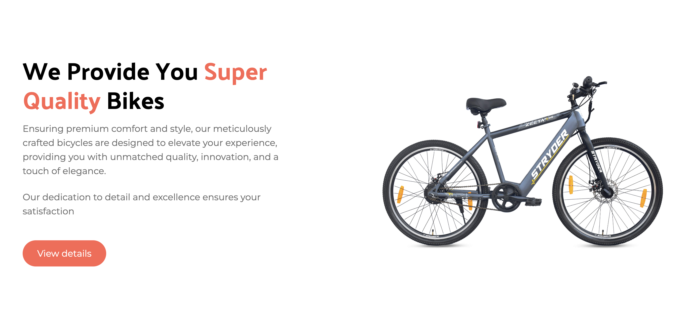
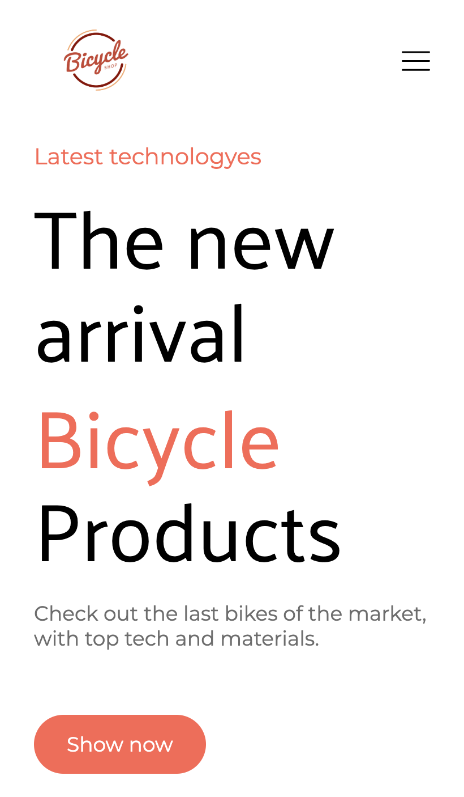
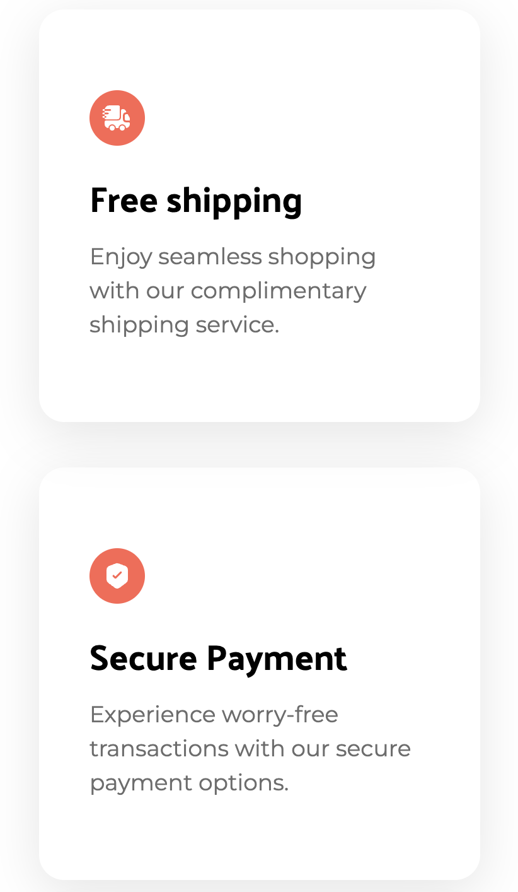
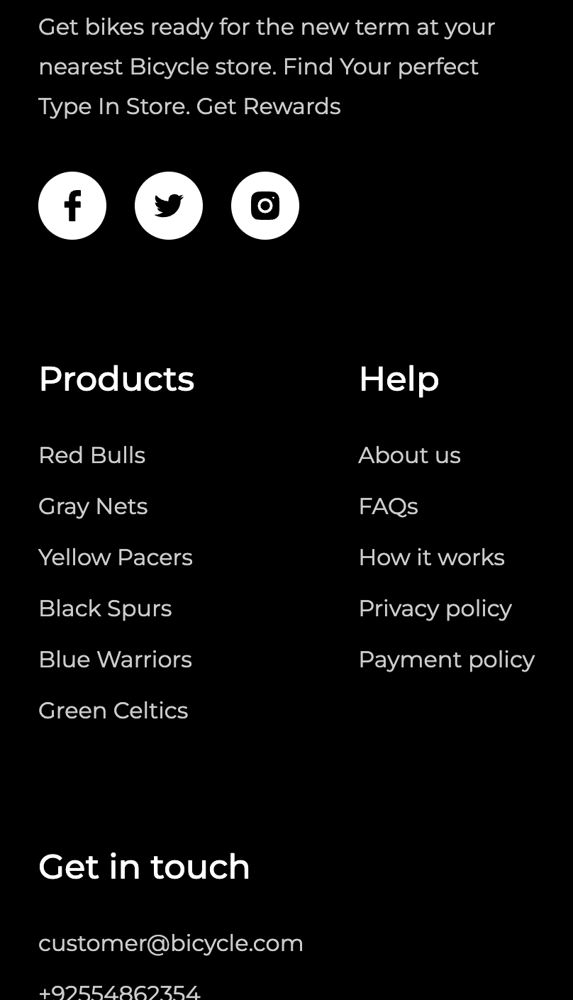
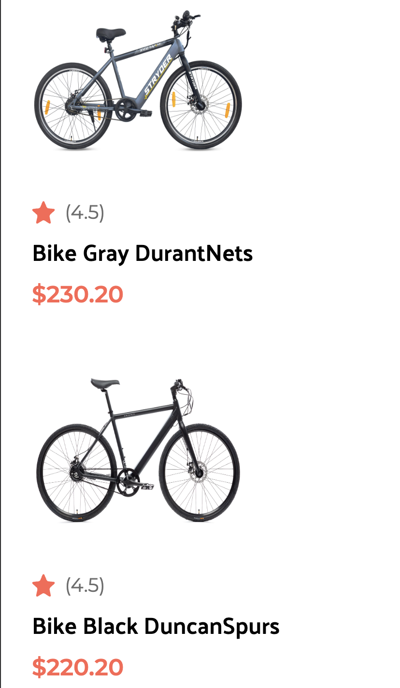

# Landing page with React.js and Tailwind.css - Responsive

This proyect is focused on the responsive design implementing Tailwind for the first time for me. I didn't focus on logic (there isn't much of it), but I am satisfied with the styling results.

## Available Scripts

In the project directory, you can run:

### `npm start`

Runs the app in the development mode.\
Open [http://localhost:3000](http://localhost:3000) to view it in your browser.

The page will reload when you make changes.\
You may also see any lint errors in the console.

# Screenshots

